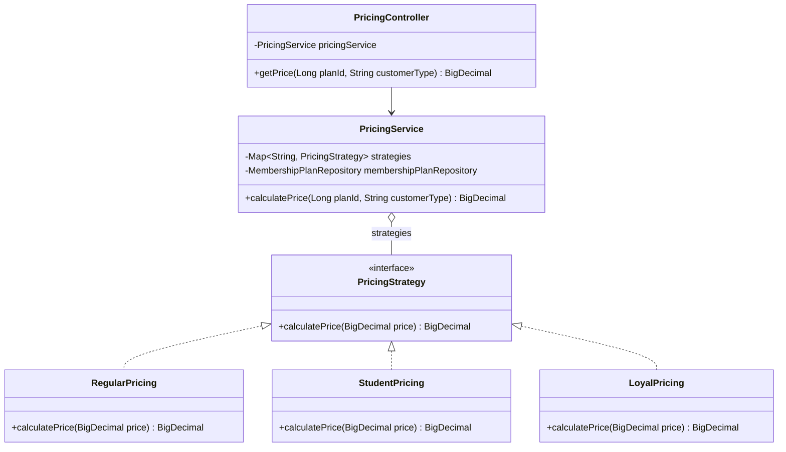
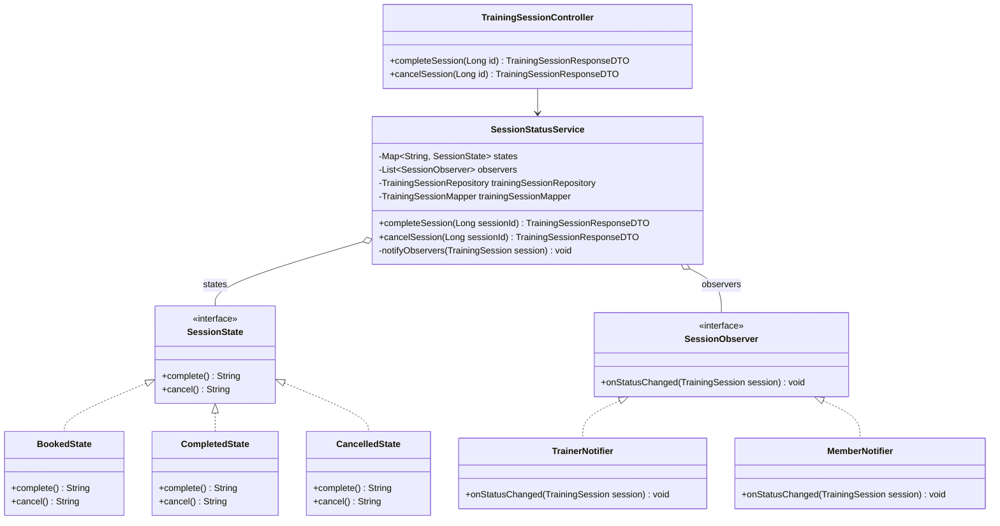
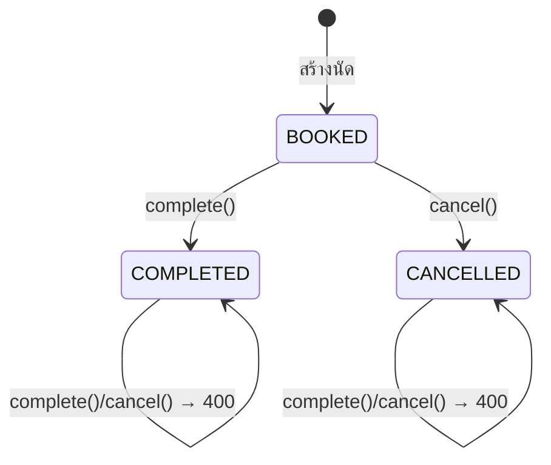

# Design Patterns — Gym Membership Management System

(path ทั้งหมดอ้างอิงจาก `src/main/java/com/gym/membership/`)

## 1. Enterprise / Architectural Patterns

| Pattern | ปัญหาที่แก้ | ไฟล์/คลาสที่ใช้ |
| --- | --- | --- |
| Layered Architecture | โค้ดทุกอย่างปนกัน แก้จุดเดียวกระทบทั้งระบบ | `controller/`, `web/` → `service/` → `domain/repository/` → `domain/entity/` |
| MVC | หน้าเว็บกับตรรกะปนกัน | `web/*WebController` (Controller), `templates/*.html` (View), Entity/DTO (Model) |
| Repository Pattern | ต้องเขียน SQL เองซ้ำๆ ทุกตาราง | `domain/repository/*Repository extends JpaRepository<X, Long>` |
| Service Layer Pattern | business logic กระจายอยู่ใน Controller | `service/*Service` (interface) + `service/*ServiceImpl` |
| DTO Pattern + Mapper | ส่ง Entity ออก API ตรงๆ ทำให้ข้อมูลลับหลุด (password) และ JSON วนซ้ำจากความสัมพันธ์ | `dto/*RequestDTO`, `dto/*ResponseDTO`, `mapper/*Mapper` |
| Dependency Injection | คลาสสร้าง dependency เองด้วย `new` ทำให้ test ยาก | `@RequiredArgsConstructor` + `private final` ทุก Controller / Service |

## 2. GoF Patterns — กลุ่ม Behavioral (3 แบบ)

เลือกกลุ่ม Behavioral เพราะปัญหาหลักของระบบฟิตเนสคือ "พฤติกรรมที่เปลี่ยนตามเงื่อนไข" (ราคาตามประเภทลูกค้า, การทำงานตามสถานะนัด) และ "การแจ้งเหตุการณ์ให้หลายฝ่าย"

| Pattern | ปัญหาที่แก้ | ไฟล์/คลาสที่ใช้ |
| --- | --- | --- |
| **Strategy** | คำนวณราคาแพ็กเกจต่างกันตามประเภทลูกค้า ถ้าใช้ if-else ต้องแก้โค้ดเดิมทุกครั้งที่มีส่วนลดใหม่ | `pattern/strategy/PricingStrategy` (interface), `RegularPricing` (×1.00), `StudentPricing` (×0.80), `LoyalPricing` (×0.90), `PricingService` (Context), `controller/PricingController` |
| **State** | นัดฝึกแต่ละสถานะทำได้ไม่เหมือนกัน (BOOKED จบ/ยกเลิกได้, COMPLETED/CANCELLED เปลี่ยนต่อไม่ได้) ถ้าใช้ if-else เช็กสถานะจะกระจายหลายที่ | `pattern/state/SessionState` (interface), `BookedState`, `CompletedState`, `CancelledState`, `SessionStatusService` (Context), endpoint `POST /api/training-sessions/{id}/complete` และ `/cancel` |
| **Observer** | เมื่อนัดเปลี่ยนสถานะต้องแจ้งหลายฝ่าย โดยไม่ให้ Service ผูกติดกับผู้รับแต่ละตัว | `pattern/observer/SessionObserver` (interface), `TrainerNotifier`, `MemberNotifier`, `SessionStatusService` (Subject — `notifyObservers()`) |

เทคนิคร่วมของทั้ง 3 แบบ: ให้ Spring รวบรวม implementation ทั้งหมดผ่าน DI (`Map<String, PricingStrategy>`, `Map<String, SessionState>`, `List<SessionObserver>`) จึงเพิ่มคลาสใหม่ได้โดยไม่แก้โค้ดเดิม (Open/Closed Principle)

## 3. Class Diagram

### 3.1 Strategy Pattern

### 3.2 State Pattern + Observer Pattern

### 3.3 State Diagram ของนัดฝึก

## 4. ผลการทดสอบ

| การทดสอบ | ผลที่ได้ |
| --- | --- |
| `GET /api/pricing?planId=1&customerType=STUDENT` | ราคา × 0.80 |
| สร้างนัดใหม่ | 201, status = BOOKED |
| complete นัดที่ BOOKED | 200, status = COMPLETED และ console แสดง `[Trainer] ...` / `[Member] ...` (Observer) |
| complete นัดที่ COMPLETED ซ้ำ | 400 "Session already completed" และไม่มีการแจ้งเตือน |
| cancel นัดที่ COMPLETED | 400 "Cannot cancel a completed session" |
| complete นัด id ที่ไม่มี | 404 "Session not found" |
