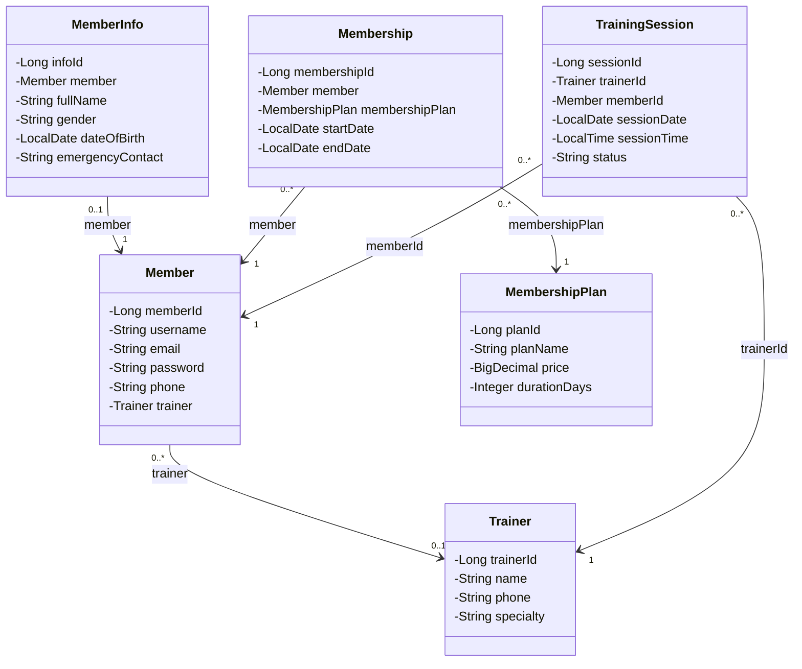

# Class Diagram

```mermaid
classDiagram
    class Trainer {
        -Long trainerId
        -String name
        -String phone
        -String specialty
    }
    class Member {
        -Long memberId
        -String username
        -String email
        -String password
        -String phone
        -Trainer trainer
    }
    class MemberInfo {
        -Long infoId
        -Member member
        -String fullName
        -String gender
        -LocalDate dateOfBirth
        -String emergencyContact
    }
    class MembershipPlan {
        -Long planId
        -String planName
        -BigDecimal price
        -Integer durationDays
    }
    class Membership {
        -Long membershipId
        -Member member
        -MembershipPlan membershipPlan
        -LocalDate startDate
        -LocalDate endDate
    }
    class TrainingSession {
        -Long sessionId
        -Trainer trainerId
        -Member memberId
        -LocalDate sessionDate
        -LocalTime sessionTime
        -String status
    }

    Member "0..*" --> "0..1" Trainer : trainer
    MemberInfo "0..1" --> "1" Member : member
    Membership "0..*" --> "1" Member : member
    Membership "0..*" --> "1" MembershipPlan : membershipPlan
    TrainingSession "0..*" --> "1" Trainer : trainerId
    TrainingSession "0..*" --> "1" Member : memberId
```

หมายเหตุ: ใน `TrainingSession` ชื่อ field `trainerId` และ `memberId` เป็น object (`Trainer`, `Member`) ไม่ใช่ตัวเลข id