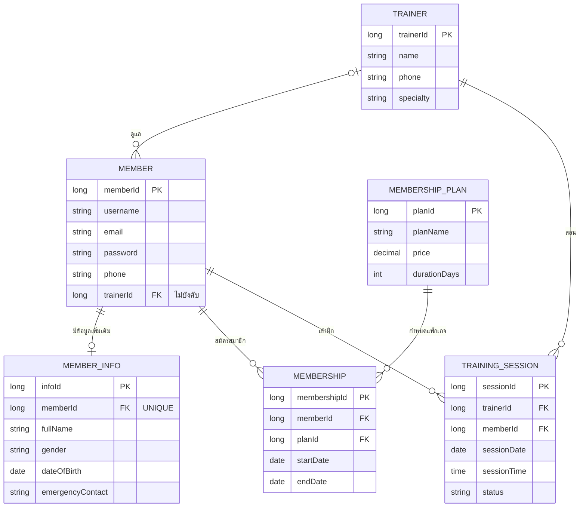

# domain model

## คำอธิบาย
- สมาชิก (Member) มีเทรนเนอร์ได้ 0 หรือ 1 คน และมีข้อมูลเพิ่มเติม (MemberInfo) ได้ไม่เกิน 1 รายการ
- สมาชิกสมัครได้หลายครั้ง (Membership) แต่ละครั้งผูกกับแพ็กเกจ (MembershipPlan) 1 แพ็กเกจ
- วันหมดอายุ (endDate) = วันเริ่ม (startDate) + จำนวนวันของแพ็กเกจ (durationDays) ระบบคำนวณให้
- การฝึก (TrainingSession) เชื่อมเทรนเนอร์ 1 คนกับสมาชิก 1 คน สถานะเริ่มต้นเป็น BOOKED