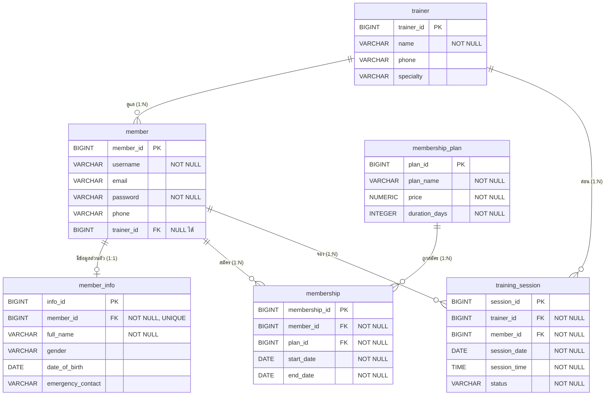

Er diagram · MD
# ER Diagram และ Data Dictionary — Gym Membership Management System
 
ฐานข้อมูล `gym_db` (PostgreSQL) มี 6 ตาราง ความสัมพันธ์ One-to-One 1 คู่ และ One-to-Many 5 คู่
Schema อ้างอิงจาก `code/src/main/resources/schema.sql` และ Entity ใน `code/src/main/java/com/gym/membership/domain/entity/`
 
## 1. ER Diagram
 

 
## 2. ความสัมพันธ์
 
| ความสัมพันธ์ | ประเภท | FK อยู่ที่ | Annotation | ความหมาย |
| --- | --- | --- | --- | --- |
| member ↔ member_info | One-to-One | `member_info.member_id` (UNIQUE) | `@OneToOne(fetch = LAZY)` + `@JoinColumn(unique = true, nullable = false)` | สมาชิก 1 คนมีข้อมูลส่วนตัวได้ไม่เกิน 1 ชุด |
| trainer → member | One-to-Many | `member.trainer_id` | `@ManyToOne(fetch = LAZY)` | เทรนเนอร์ 1 คนดูแลสมาชิกได้หลายคน (สมาชิกไม่มีเทรนเนอร์ก็ได้) |
| member → membership | One-to-Many | `membership.member_id` | `@ManyToOne(fetch = LAZY)` | สมาชิกสมัครแพ็กเกจได้หลายครั้ง |
| membership_plan → membership | One-to-Many | `membership.plan_id` | `@ManyToOne(fetch = LAZY)` | แพ็กเกจ 1 แบบถูกสมัครได้หลายครั้ง |
| trainer → training_session | One-to-Many | `training_session.trainer_id` | `@ManyToOne(fetch = LAZY)` | เทรนเนอร์ 1 คนมีนัดสอนได้หลายนัด |
| member → training_session | One-to-Many | `training_session.member_id` | `@ManyToOne(fetch = LAZY)` | สมาชิก 1 คนจองนัดฝึกได้หลายนัด |
 
หลักการวาง FK: ความสัมพันธ์ 1:N วาง FK ไว้ฝั่ง "หลาย" เสมอ ส่วน 1:1 วางที่ `member_info` เพราะเป็นข้อมูลเสริมที่ต้องมี member ก่อน และใส่ UNIQUE กันไม่ให้กลายเป็น 1:N
 
## 3. Data Dictionary
 
### 3.1 trainer — ข้อมูลเทรนเนอร์ (Entity: `Trainer`)
 
| คอลัมน์ | ชนิด (Java → SQL) | Key / Constraint | คำอธิบาย |
| --- | --- | --- | --- |
| trainer_id | Long → BIGINT | PK, auto increment | รหัสเทรนเนอร์ |
| name | String → VARCHAR(255) | NOT NULL | ชื่อเทรนเนอร์ |
| phone | String → VARCHAR(255) | — | เบอร์โทร |
| specialty | String → VARCHAR(255) | — | ความเชี่ยวชาญ เช่น Weight Training, Yoga |
 
### 3.2 member — บัญชีสมาชิก (Entity: `Member`)
 
| คอลัมน์ | ชนิด (Java → SQL) | Key / Constraint | คำอธิบาย |
| --- | --- | --- | --- |
| member_id | Long → BIGINT | PK, auto increment | รหัสสมาชิก |
| username | String → VARCHAR(255) | NOT NULL, INDEX | ชื่อผู้ใช้ |
| email | String → VARCHAR(255) | — | อีเมล |
| password | String → VARCHAR(255) | NOT NULL | รหัสผ่าน (ไม่ส่งกลับใน Response DTO) |
| phone | String → VARCHAR(255) | — | เบอร์โทร |
| trainer_id | Trainer → BIGINT | FK → trainer, NULL ได้, INDEX | เทรนเนอร์ประจำตัว |
 
### 3.3 member_info — ข้อมูลส่วนตัวสมาชิก (Entity: `MemberInfo`)
 
| คอลัมน์ | ชนิด (Java → SQL) | Key / Constraint | คำอธิบาย |
| --- | --- | --- | --- |
| info_id | Long → BIGINT | PK, auto increment | รหัสข้อมูลส่วนตัว |
| member_id | Member → BIGINT | FK → member, NOT NULL, UNIQUE | เจ้าของข้อมูล (1:1) |
| full_name | String → VARCHAR(255) | NOT NULL | ชื่อ-นามสกุลจริง |
| gender | String → VARCHAR(255) | — | เพศ |
| date_of_birth | LocalDate → DATE | — | วันเกิด |
| emergency_contact | String → VARCHAR(255) | — | ผู้ติดต่อกรณีฉุกเฉิน |
 
### 3.4 membership_plan — แพ็กเกจสมาชิก (Entity: `MembershipPlan`)
 
| คอลัมน์ | ชนิด (Java → SQL) | Key / Constraint | คำอธิบาย |
| --- | --- | --- | --- |
| plan_id | Long → BIGINT | PK, auto increment | รหัสแพ็กเกจ |
| plan_name | String → VARCHAR(255) | NOT NULL | ชื่อแพ็กเกจ เช่น รายเดือน, รายปี |
| price | BigDecimal → NUMERIC(38,2) | NOT NULL | ราคา (บาท) ใช้ BigDecimal เพื่อความแม่นยำของเงิน |
| duration_days | Integer → INTEGER | NOT NULL | จำนวนวันของแพ็กเกจ |
 
### 3.5 membership — การสมัครแพ็กเกจ (Entity: `Membership`)
 
| คอลัมน์ | ชนิด (Java → SQL) | Key / Constraint | คำอธิบาย |
| --- | --- | --- | --- |
| membership_id | Long → BIGINT | PK, auto increment | รหัสการสมัคร |
| member_id | Member → BIGINT | FK → member, NOT NULL, INDEX | สมาชิกที่สมัคร |
| plan_id | MembershipPlan → BIGINT | FK → membership_plan, NOT NULL, INDEX | แพ็กเกจที่เลือก |
| start_date | LocalDate → DATE | NOT NULL | วันเริ่ม |
| end_date | LocalDate → DATE | NOT NULL, INDEX | วันหมดอายุ (ระบบคำนวณ = start_date + duration_days) |
 
### 3.6 training_session — นัดฝึก (Entity: `TrainingSession`)
 
| คอลัมน์ | ชนิด (Java → SQL) | Key / Constraint | คำอธิบาย |
| --- | --- | --- | --- |
| session_id | Long → BIGINT | PK, auto increment | รหัสนัด |
| trainer_id | Trainer → BIGINT | FK → trainer, NOT NULL, INDEX | เทรนเนอร์ผู้สอน |
| member_id | Member → BIGINT | FK → member, NOT NULL, INDEX | สมาชิกผู้จอง |
| session_date | LocalDate → DATE | NOT NULL, INDEX | วันที่นัด |
| session_time | LocalTime → TIME | NOT NULL | เวลานัด |
| status | String → VARCHAR(255) | NOT NULL | BOOKED / COMPLETED / CANCELLED |
 
## 4. Index, Fetch Type และ Cascade
 
| เรื่อง | การตั้งค่า | เหตุผล |
| --- | --- | --- |
| Index | FK ทุกตัว (`trainer_id`, `member_id`, `plan_id`), `member.username`, `membership.end_date`, `training_session.session_date` | PostgreSQL ไม่สร้าง index ให้ FK อัตโนมัติ และคอลัมน์เหล่านี้ใช้ JOIN / ค้นหาบ่อย |
| Fetch Type | `LAZY` ทุกความสัมพันธ์ | ค่าเริ่มต้นของ `@ManyToOne` / `@OneToOne` คือ EAGER ซึ่งดึงข้อมูลที่ผูกมาทุกครั้งแม้ไม่ได้ใช้ |
| Cascade | ไม่ใช้ | แต่ละตารางมีวงจรชีวิตของตัวเอง เช่น ลบสมาชิกต้องไม่ลบเทรนเนอร์ และประวัติการสมัคร/นัดฝึกต้องไม่หายเพราะลบข้อมูลแม่ (ใช้ RESTRICT ของ FK และ Service ตอบ 409 แทน) |