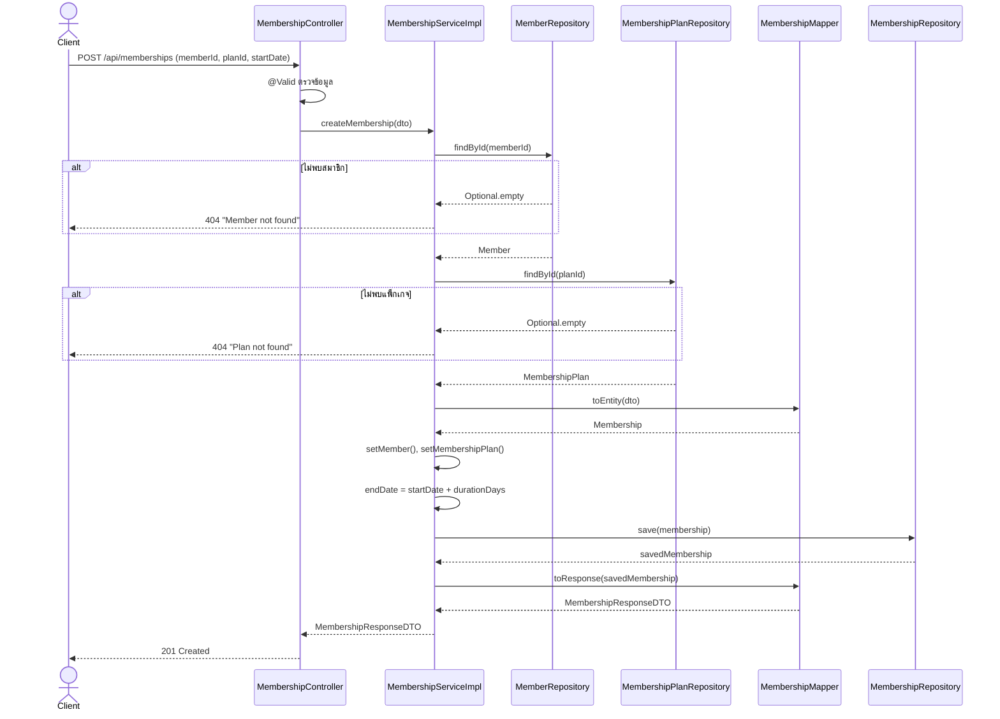
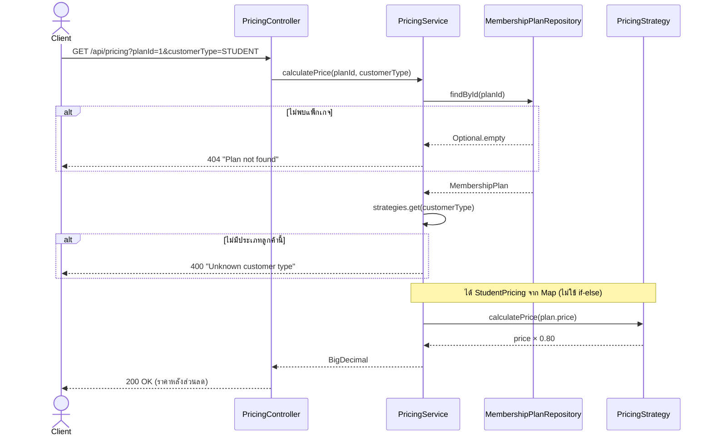
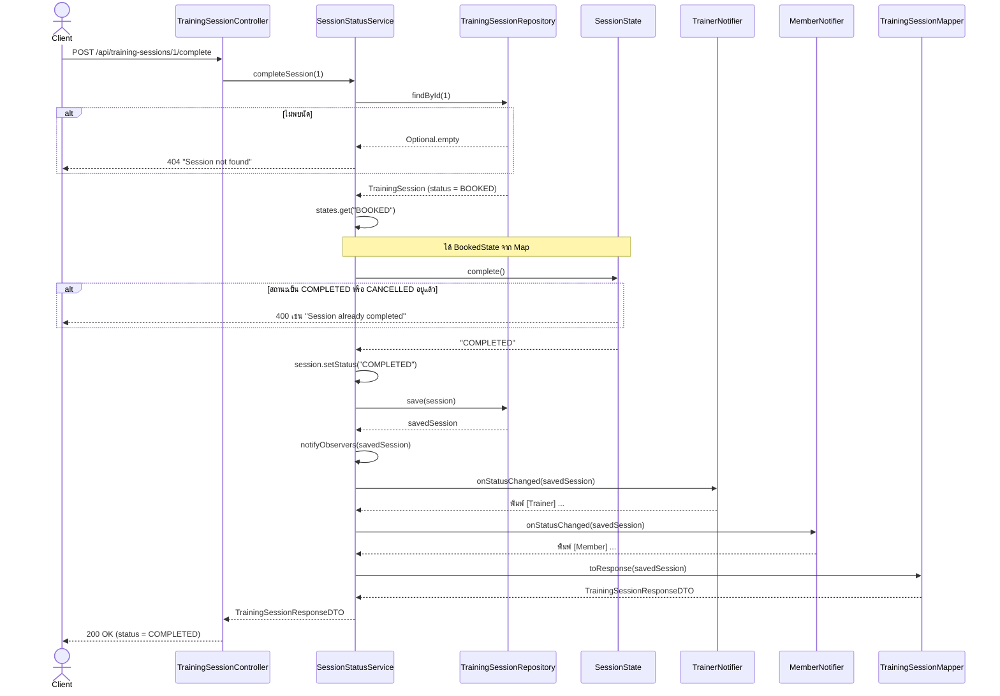

# Sequence Diagrams — Gym Membership Management System

ลำดับการทำงานของ 3 flow หลักของระบบ ตั้งแต่ Client ส่ง request จนได้ response
(ชื่อคลาสและเมธอดตรงกับโค้ดใน `code/src/main/java/com/gym/membership/`)

## 1. สมัครแพ็กเกจสมาชิก (คำนวณวันหมดอายุอัตโนมัติ)

`POST /api/memberships`

## 2. คำนวณราคาตามประเภทลูกค้า (Strategy Pattern)

`GET /api/pricing?planId={id}&customerType={REGULAR|STUDENT|LOYAL}`

## 3. จบนัดฝึก (State Pattern + Observer Pattern)

`POST /api/training-sessions/{id}/complete`

หมายเหตุ: error ทุกกรณี (404 / 400) ถูก `GlobalExceptionHandler` แปลงเป็น JSON รูปแบบเดียวกัน (`timestamp`, `status`, `error`, `message`, `path`)
