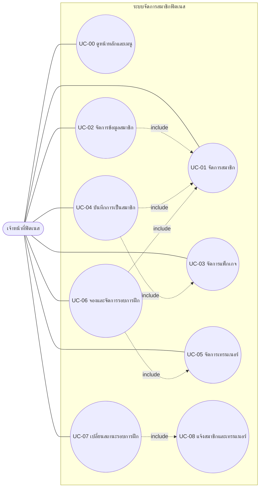
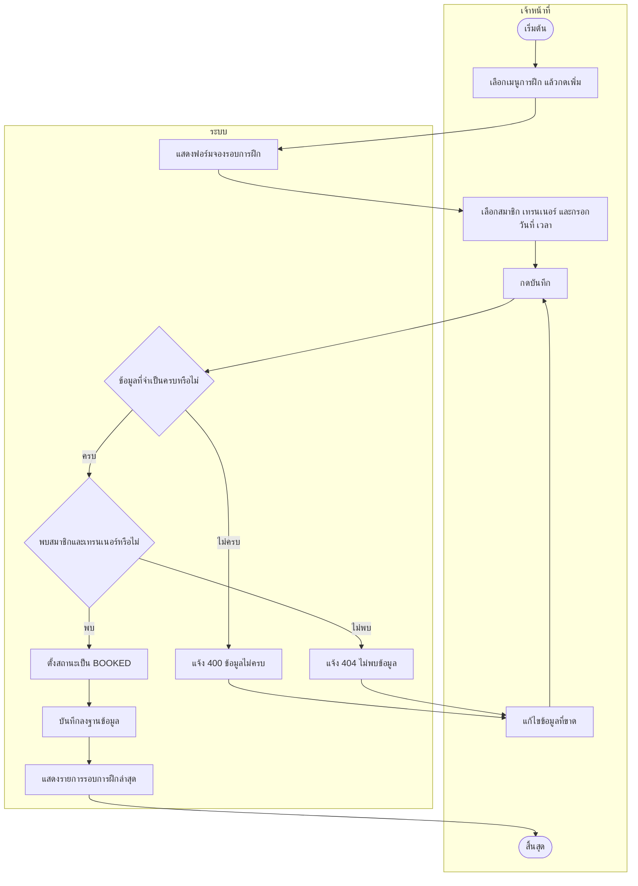
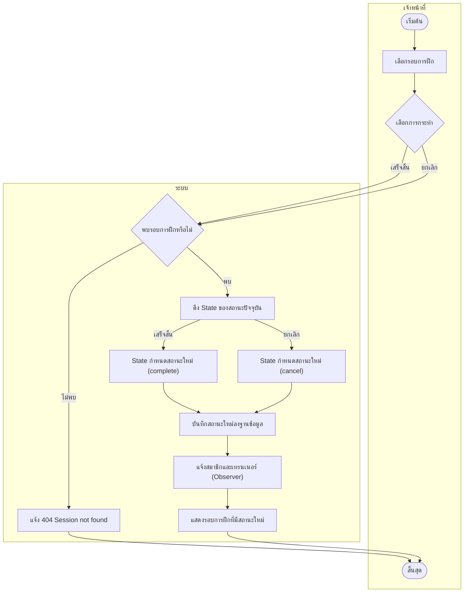
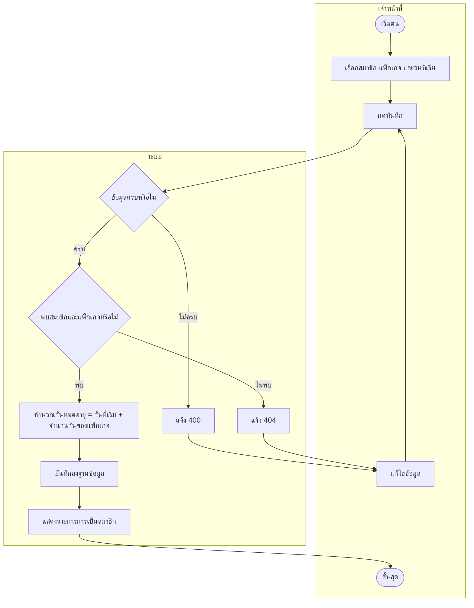

# Use Case และ Activity Diagram: ระบบจัดการสมาชิกฟิตเนส (Group28)

ผู้จัดทำ: นายฉัตรดนัย ไกรราช

## 1. Use Case Diagram

ผู้กระทำหลักคือ **เจ้าหน้าที่ฟิตเนส** ใช้งานผ่านหน้าเว็บ (Thymeleaf) และ REST API

## 2. Use Case Description

### สรุปทุก Use Case

| รหัส | ชื่อ | ผู้กระทำ | คำอธิบายสั้น |
| ---- | ---- | -------- | ------------ |
| UC-00 | ดูหน้าหลักและเมนู | เจ้าหน้าที่ | เปิดหน้าแรกและเลือกเมนูไปยังโมดูลต่างๆ |
| UC-01 | จัดการสมาชิก | เจ้าหน้าที่ | เพิ่ม ดู แก้ไข ลบ ข้อมูลสมาชิก (ไม่แสดงรหัสผ่าน) |
| UC-02 | จัดการข้อมูลสมาชิก | เจ้าหน้าที่ | เพิ่ม ดู แก้ไข ลบ ข้อมูลส่วนตัวเพิ่มเติม (สมาชิก 1 คนมีได้ 1 รายการ) |
| UC-03 | จัดการแพ็กเกจ | เจ้าหน้าที่ | เพิ่ม ดู แก้ไข ลบ แพ็กเกจ (ชื่อ ราคา จำนวนวัน) |
| UC-04 | บันทึกการเป็นสมาชิก | เจ้าหน้าที่ | สมัครสมาชิกตามแพ็กเกจ ระบบคำนวณวันหมดอายุ |
| UC-05 | จัดการเทรนเนอร์ | เจ้าหน้าที่ | เพิ่ม ดู แก้ไข ลบ ข้อมูลเทรนเนอร์ |
| UC-06 | จองและจัดการรอบการฝึก | เจ้าหน้าที่ | จอง ดู แก้ไข ลบ รอบฝึกของสมาชิกกับเทรนเนอร์ ระบบตั้งสถานะเริ่มต้น BOOKED |
| UC-07 | เปลี่ยนสถานะรอบการฝึก | เจ้าหน้าที่ | กดเสร็จสิ้น (complete) หรือยกเลิก (cancel) รอบการฝึก |
| UC-08 | แจ้งสมาชิกและเทรนเนอร์ | ระบบ (ทำงานอัตโนมัติ) | เมื่อสถานะรอบฝึกเปลี่ยน ระบบแจ้งสมาชิกและเทรนเนอร์ที่เกี่ยวข้อง |

### UC-06 จองและจัดการรอบการฝึก

| หัวข้อ | รายละเอียด |
| ------ | ---------- |
| ชื่อ Use Case | จองและจัดการรอบการฝึก |
| ผู้กระทำ | เจ้าหน้าที่ฟิตเนส |
| คำอธิบาย | เจ้าหน้าที่บันทึกการจองรอบฝึกให้สมาชิกกับเทรนเนอร์ พร้อมวันที่และเวลา |
| เงื่อนไขก่อนเริ่ม | มีข้อมูลสมาชิกและเทรนเนอร์อยู่ในระบบแล้ว |
| Main Flow | 1. เจ้าหน้าที่เลือกเมนู "การฝึก" แล้วกด "เพิ่ม" 2. ระบบแสดงฟอร์มจองรอบการฝึก 3. เจ้าหน้าที่เลือกสมาชิก เทรนเนอร์ และกรอกวันที่ เวลา 4. เจ้าหน้าที่กดบันทึก 5. ระบบตรวจสอบว่าข้อมูลที่จำเป็นครบ 6. ระบบค้นหาสมาชิกและเทรนเนอร์ตามรหัสที่เลือก 7. ระบบตั้งสถานะเป็น "BOOKED" และบันทึกลงฐานข้อมูล 8. ระบบแสดงรายการรอบการฝึกที่อัปเดตแล้ว |
| Alternative Flow | A1 (ข้อ 5) ข้อมูลที่จำเป็นว่าง: ระบบตอบ 400 และแจ้งให้กรอกใหม่ A2 (ข้อ 6) ไม่พบสมาชิกหรือเทรนเนอร์: ระบบตอบ 404 และไม่บันทึก |
| เงื่อนไขหลังเสร็จ | มีรอบการฝึกใหม่สถานะ BOOKED ในฐานข้อมูล |
| หมายเหตุ | การดู แก้ไข ลบ ทำผ่านรายการเดียวกัน (GET / PUT / DELETE `/api/training-sessions`) |

### UC-07 เปลี่ยนสถานะรอบการฝึก

| หัวข้อ | รายละเอียด |
| ------ | ---------- |
| ชื่อ Use Case | เปลี่ยนสถานะรอบการฝึก |
| ผู้กระทำ | เจ้าหน้าที่ฟิตเนส |
| คำอธิบาย | เจ้าหน้าที่ทำเครื่องหมายรอบการฝึกว่าเสร็จสิ้นหรือยกเลิก โดยใช้ State Pattern กำหนดสถานะใหม่ |
| เงื่อนไขก่อนเริ่ม | มีรอบการฝึกอยู่ในระบบ |
| Main Flow | 1. เจ้าหน้าที่เลือกรอบการฝึกที่ต้องการ 2. เจ้าหน้าที่เลือกการกระทำ "เสร็จสิ้น" (`POST /{id}/complete`) หรือ "ยกเลิก" (`POST /{id}/cancel`) 3. ระบบค้นหารอบการฝึกตามรหัส 4. ระบบดึง State ของสถานะปัจจุบัน และให้ State กำหนดสถานะใหม่ 5. ระบบบันทึกสถานะใหม่ลงฐานข้อมูล 6. ระบบแจ้งผู้สังเกตการณ์ทั้งหมด (UC-08) 7. ระบบแสดงรอบการฝึกที่มีสถานะใหม่ |
| Alternative Flow | A1 (ข้อ 3) ไม่พบรอบการฝึก: ระบบตอบ 404 "Session not found" และไม่เปลี่ยนสถานะ |
| เงื่อนไขหลังเสร็จ | สถานะรอบการฝึกถูกเปลี่ยนและมีการแจ้งผู้เกี่ยวข้องแล้ว |

### UC-08 แจ้งสมาชิกและเทรนเนอร์

| หัวข้อ | รายละเอียด |
| ------ | ---------- |
| ชื่อ Use Case | แจ้งสมาชิกและเทรนเนอร์ |
| ผู้กระทำ | ระบบ (Observer Pattern) |
| เงื่อนไขก่อนเริ่ม | สถานะรอบการฝึกเพิ่งถูกเปลี่ยนและบันทึกแล้ว (จาก UC-07) |
| Main Flow | 1. ระบบเรียกผู้สังเกตการณ์ทุกตัว (MemberNotifier, TrainerNotifier) 2. แต่ละตัวแจ้งผู้ที่เกี่ยวข้องว่าสถานะรอบการฝึกเปลี่ยนไป |
| เงื่อนไขหลังเสร็จ | สมาชิกและเทรนเนอร์ได้รับแจ้งการเปลี่ยนสถานะ |

### UC-04 บันทึกการเป็นสมาชิก

| หัวข้อ | รายละเอียด |
| ------ | ---------- |
| ชื่อ Use Case | บันทึกการเป็นสมาชิก |
| ผู้กระทำ | เจ้าหน้าที่ฟิตเนส |
| เงื่อนไขก่อนเริ่ม | มีสมาชิกและแพ็กเกจในระบบแล้ว |
| Main Flow | 1. เจ้าหน้าที่เลือกเมนู "การเป็นสมาชิก" แล้วกด "เพิ่ม" 2. เจ้าหน้าที่เลือกสมาชิก แพ็กเกจ และวันที่เริ่ม แล้วกดบันทึก 3. ระบบตรวจสอบข้อมูลและค้นหาสมาชิกกับแพ็กเกจ 4. ระบบคำนวณวันหมดอายุ = วันที่เริ่ม + จำนวนวันของแพ็กเกจ 5. ระบบบันทึกและแสดงรายการ |
| Alternative Flow | A1 ข้อมูลว่าง: ตอบ 400 / A2 ไม่พบสมาชิกหรือแพ็กเกจ: ตอบ 404 |
| เงื่อนไขหลังเสร็จ | มีรายการการเป็นสมาชิกพร้อมวันหมดอายุ |

### UC-01, 02, 03, 05 การจัดการข้อมูล (CRUD)

| หัวข้อ | รายละเอียด |
| ------ | ---------- |
| ผู้กระทำ | เจ้าหน้าที่ฟิตเนส |
| Main Flow | 1. เลือกเมนูของโมดูลนั้น 2. ระบบแสดงรายการทั้งหมด 3. เลือกเพิ่ม แก้ไข หรือลบ 4. กรอกข้อมูลแล้วกดบันทึก (กรณีลบให้ยืนยัน) 5. ระบบตรวจสอบและบันทึก แล้วแสดงรายการล่าสุด |
| Alternative Flow | ข้อมูลที่จำเป็นว่าง: ตอบ 400 / ไม่พบรหัสที่ระบุ: ตอบ 404 |
| หมายเหตุ | UC-01 ไม่แสดงรหัสผ่านในข้อมูลที่ส่งกลับ / UC-02 สมาชิก 1 คนมีข้อมูลได้ 1 รายการ |

### UC-00 ดูหน้าหลักและเมนู

| หัวข้อ | รายละเอียด |
| ------ | ---------- |
| ผู้กระทำ | เจ้าหน้าที่ฟิตเนส |
| Main Flow | 1. เปิดหน้าแรก (`/`) 2. ระบบแสดงแถบเมนูและการ์ดไปยัง 6 โมดูล 3. เจ้าหน้าที่เลือกเมนูที่ต้องการ 4. ระบบพาไปหน้ารายการของโมดูลนั้น และทุกหน้ามีแถบเมนูด้านบนให้เลือกไปหน้าอื่นได้ |

## 3. Activity Diagram

### 3.1 จองรอบการฝึก

### 3.2 เปลี่ยนสถานะรอบการฝึก (เสร็จสิ้น / ยกเลิก)

### 3.3 บันทึกการเป็นสมาชิก

